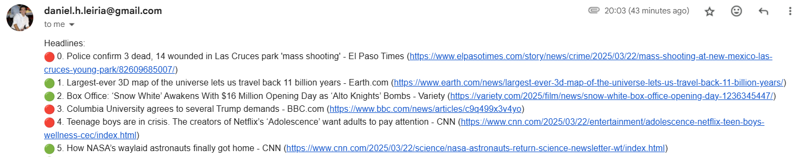

# Daily debrief

A Python project that fetches the latest news, performs sentiment analysis, retrieves NASA’s Astronomy Picture of the Day, and emails a concise daily summary right to your inbox.

## Features

### 1. Daily News Retrieval
- US headlines (in English)
- Portugal news (in Portuguese)
- Company-specific (job) news (in English)

Check the news api documenetation in: [News API](https://newsapi.org/)

**Date Range:** Pulls news from yesterday to today at the time the script runs.

### 2. Sentiment Analysis (NLP)

Assesses each piece of news as negative, neutral, or positive.

The result is a color-coded representation:
- 🔴 Red → Negative
- 🟡 Yellow → Neutral
- 🟢 Green → Positive

### 3. NASA Astronomy Picture of the Day

Fetches the latest APOD image or video (with a brief explanation).

### 4. Automated Email Report

Sends a daily email at 8:00 AM containing:
- All gathered news with sentiment analysis
- NASA’s APOD (embedded or linked)

Scheduled via [PythonAnywhere](https://www.pythonanywhere.com/) (or your preferred hosting/scheduling solution).

### 5. Life tracker (Memento Mori)

It calculates the remaining life that the user has as a percentage.
It is necessary that the user adds his birthday and expected years the he/she believes they will live.

## Project Overview

**APIs Used:**
- News API (for headlines and custom queries).
- NASA API (for Astronomy Picture of the Day - APOD).

**Sentiment Analysis:** Basic NLP approach on both English and Portuguese sources to determine sentiment polarity.

**Automation:** Cron-like scheduling on PythonAnywhere triggers the script every day at 8:00 AM.

**Reporting:** A single email summarizes top news stories, color-coded sentiment, and includes the NASA APOD.

## Directory Tree
This project has the following directory structure and the next sections attempt to explain them.

```
nlp-email_news
|   .env
|   .gitignore
|   config.yaml
|   email_sender.py
|   get_dates.py
|   main.py
|   nasa_apod_request.py
|   news_loop.py
|   README.md
|   requirements.txt
|   sentiment_analysis.py
|   memento_mori.py
|   
+---venv
\---__pycache__
```

## Installation & Setup

### 1. Clone the Repository

```
git clone https://github.com/DanLeiria/nlp-email-news.git
cd nlp-email-news
```

### 2. Create a Virtual Environment (optional but recommended)

Run in bash the following:
```
python -m venv venv
source venv\bin\activate
```

### 3. Install Dependencies
```
pip install -r requirements.txt
```

### 4. Configure Environment Variables
You’ll need API keys for the News API and NASA. Create an environment file (``.env``) and a config file (``config.yaml``) inside your main folder to store your settings and passwords:

In the ``.env`` file, add the code below and replace all `...` with your personal details:
```
NEWS_API_KEY = "..." # Replace with the your (individual) News API key
NASA_API_KEY = "..." # Replace with the your (individual) NASA API key

PASSWORD = "..." # Replace with the your (individual) Gmail app password (NOT YOUR EMAIL PASSWORD - See more in note below)
HOST = "smtp.gmail.com" # If you use gmail like me, if not look on the internet what to add here
USERNAME_EMAIL = "..." # Replace with your email here
RECEIVER = "..." # Replace with your email here

EXPECTED_YEARS = "80" # Replace with the number of years that you believe you will leave
BIRTHDAY = "19/02/1997" # Replace with your birthday date (format: dd/mm/yyyy)
```


In the ``config.yaml`` file, add the code below and replace all `...` with your personal details:
```
# Email parameters
EMAIL_SUBJECT: "..." # Replace with the subject you want in the email

# News parameters
NEWS_SORT: "relevancy" # Keep this, organizes the news according to their relevancy
NEWS_QUERY_1: "Portugal" # Replace with the country you want to get news from
NEWS_LANG_1: "pt"  # Language of the news of query 1
NEWS_LIMIT_1: 15 # Maximum number of news of query 1
NEWS_QUERY_2: "Danfoss" # Replace with the other subject you want to get news from (this case - my job)
NEWS_LANG_2: "en"  # Language of the news of query 2
NEWS_LIMIT_2: 10 # Maximum number of news of query 2
NEWS_LIMIT_3: 10 # Maximum number of news of query 3
```


**Note:** To create gmail password, see here: https://www.febooti.com/products/automation-workshop/tutorials/enable-google-app-passwords-for-smtp.html

**Note:** Do not share ``.env`` with no one - neither push it to your GitHub. Add it to the file ``.gitignore`` before any commit.

### 5. Schedule the Script

In [PythonAnywhere](https://www.pythonanywhere.com/), go to the “Tasks” or “Schedule” section.
Set the script to run daily at 8:00 AM local time.
Adjust your time zone or scheduling preferences as needed.
Remember to add all code and files into the website and install it using Bash.

In **PythonAnywhere**, it might be tricky to run it at the beginning.
In main.py there are a few comments that are marked to comment or uncomment accordingly when adding it in the website.


## License
This project is licensed under the MIT License - feel free to modify and distribute as you see fit.

## Example of the email


